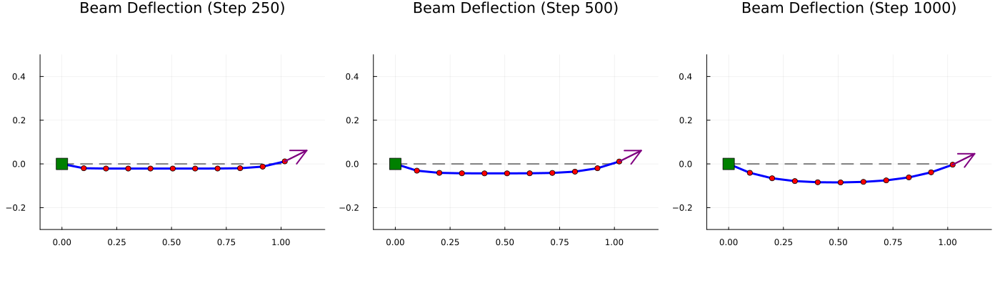
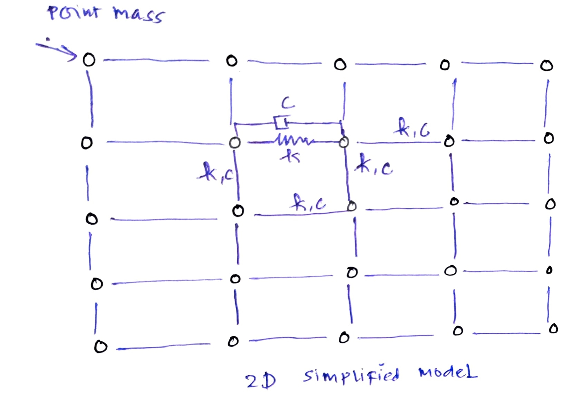

* Introduction

* Descrete Differential Geometry Method

* Numerical Modeling of Structure
\[ Mq^{..} + Cq^{.} + Kq(t) = F^{ext}(t) \]

- M :: Lumped Mass Matrix
- C :: Damping Coefficient
- K :: Spring Constant
  
  where \( q^{..}(t) , q^{.}(t), q(t) \) represent accelration , velocity and position 

**  Magnetic Actuation
The Magnetic Force is given by equation
\[F_{\text{magnetic}} =  \chi B(t)^2 * B_{\text{direction}} \]
where
- \chi is the magnetic Susceptiblity
- B(t) is given by equation : \( B_{\text{strength}} * \sin(2  \pi  f t) \)  where \( f  \) is the frequency
- \( B_{\text{direction}} \) is the unit vector  

** Solution by Implicit Euler Method

\begin{align*}
q(t_{k+1}) &= q_{t_k} + q^{.}(t_{k+1}) dt \\
q^{.}(t_{k+1}) &= q^{.}_{t_k} + q^{..}(t_{k+1}) dt \\
\end{align*}
* 1D implementations
** Numerical Framework
** Implementations
*** 1D line element

* 2D implementations
** Computational nodes
following Assumptions has been made
- Material is homogenous , and can be modelled by point mass connected  with each other by spring , and damping as shown in figure below
  

** Plots  
